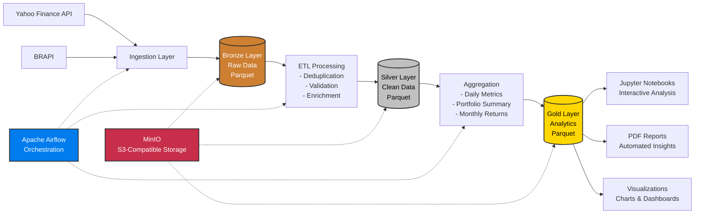

# B3 Data Platform

> Financial data lakehouse for B3 (Brazilian Stock Exchange) using the **Medallion Architecture** (Bronze → Silver → Gold).

[](https://www.python.org/)
[](https://pola.rs/)
[](https://spark.apache.org/)

---

## Architecture Overview

This platform implements a **Medallion Architecture** (Bronze-Silver-Gold) for processing Brazilian stock market data:



### Medallion Layers Explained

| Layer      | Description                        | Data Quality                    | Use Case                       |
| ---------- | ---------------------------------- | ------------------------------- | ------------------------------ |
| **Bronze** | Raw data as-is from sources        | Low - No transformations        | Audit trail, reprocessing      |
| **Silver** | Cleaned, deduplicated, validated   | Medium - Business rules applied | Analytics queries, ML features |
| **Gold**   | Aggregated, business-ready metrics | High - Production-ready         | Reports, dashboards, KPIs      |

---

## Stack

| Component        | Tool                      | Purpose                              |
| ---------------- | ------------------------- | ------------------------------------ |
| Processing       | **Polars** + **PySpark**  | Transformations (medium & large vol) |
| Orchestration    | **Apache Airflow**        | DAG per layer, retry & sensors       |
| Storage          | **MinIO** (local S3)      | Object storage for Parquet files     |
| Notebooks        | **JupyterLab**            | Interactive exploration              |
| Visualisation    | **Plotly** + **Seaborn**  | Charts inside notebooks              |
| Data source      | **Yahoo Finance** / BRAPI | B3 daily OHLCV prices                |
| Containerisation | **Docker Compose**        | Full local environment               |

OHLCV é a sigla em inglês para Open (Abertura), High (Máxima), Low (Mínima), Close (Fechamento) e Volume

---

## Project Structure

Top-level folders follow a `<letter>_<name>` ordering pattern so they
appear in the logical data-flow order in the file tree.

```
b3-data-plataform/
├── a_configs/          # Settings, Spark factory, MinIO client, JSON logger
├── b_models/           # Pydantic models + Spark schemas
├── c_ingestion/        # Yahoo Finance + BRAPI adapters
├── d_processing/
│   ├── a_bronze/       # Raw writer / reader
│   ├── b_silver/       # ETL transformations
│   ├── c_gold/         # Aggregations (daily metrics, portfolio, monthly)
│   └── d_report/       # PDF report generation with charts
├── e_validation/       # Quality checks (fail-fast assertions)
├── f_pipelines/        # Bronze / Silver / Gold pipeline classes
├── g_storage/          # Storage adapters (Parquet / Delta / DB)
├── h_dags/             # Airflow DAGs (Bronze → Silver → Gold chain)
├── i_notebooks/        # 01 Bronze · 02 Silver · 03 Gold · 04 Exploration
├── j_data/             # Local Parquet store (Medallion layers)
│   ├── a_bronze/       # Raw ingested data (partitioned by trade_date)
│   ├── b_silver/       # Cleaned & validated data
│   └── c_gold/         # Aggregated analytics-ready tables
├── k_logs/             # Application logs (JSON structured)
├── l_tests/            # pytest unit tests + conftest fixtures
├── m_docs/             # Project documentation (PRDs, architecture)
├── n_reports/          # Generated PDF reports
├── z_infra/            # Docker infrastructure
│   ├── docker-compose.yml    # MinIO + PostgreSQL + Airflow + JupyterLab
│   ├── Dockerfile.airflow    # Custom Airflow image
│   └── .dockerignore         # Docker build exclusions
├── run_pipeline.py     # One-command full pipeline execution
├── setup.sh            # Setup & management script (Linux/macOS/WSL)
├── setup.bat           # Windows launcher
└── requirements.txt    # Python dependencies
```

---

## Quick Start

### 1 — Local (no Docker)

```bash
# Create virtual environment
python -m venv .venv && source .venv/bin/activate
pip install -r requirements.txt

# Copy env file
cp .env.example .env

# Option 1: Run complete pipeline with one command (recommended)
python run_pipeline.py

# Option 2: Run each layer manually
python -c "
from f_pipelines.a_bronze_pipeline import BronzePipeline
from f_pipelines.b_silver_pipeline import SilverPipeline
from f_pipelines.c_gold_pipeline import GoldPipeline
from f_pipelines.d_report_pipeline import ReportPipeline

BronzePipeline().run()   # Ingest raw data
SilverPipeline().run()   # Clean & transform
GoldPipeline().run()     # Aggregate metrics
ReportPipeline().run()   # Generate PDF report
"

# Start JupyterLab for interactive exploration
jupyter lab i_notebooks/
```

**Pipeline Execution Output:**

```
================================================================================
B3 DATA PLATFORM - FULL PIPELINE EXECUTION
================================================================================

[1/4] Running Bronze Pipeline (Data Ingestion)...
Bronze complete: 2988 rows ingested

[2/4] Running Silver Pipeline (Data Transformation)...
Silver complete

[3/4] Running Gold Pipeline (Analytics & Aggregation)...
Gold complete

[4/4] Running Report Pipeline (PDF Generation)...
Report complete: /path/to/report_260720_1509.pdf

================================================================================
PIPELINE EXECUTION COMPLETE!
================================================================================
```

### 2 — Docker Compose (full stack)

```bash
# Using the automated setup script (recommended)
./setup.sh setup     # Full setup
./setup.sh up        # Start containers only
./setup.sh down      # Stop containers
./setup.sh status    # Check status
./setup.sh logs      # View logs

# Or manually
cd z_infra
docker compose up -d

# Services:
#   JupyterLab  →  http://localhost:8888  (token: b3data)
#   Airflow UI  →  http://localhost:8080  (user/pass: admin/admin)
#   MinIO UI    →  http://localhost:9001  (user/pass: minioadmin/minioadmin)
```

### 3 — Run tests

```bash
pytest -v
```

---

## Notebooks

| #   | Notebook                    | Description                             |
| --- | --------------------------- | --------------------------------------- |
| 01  | `01_bronze_ingestion.ipynb` | Ingest raw prices, inspect Bronze layer |
| 02  | `02_silver_etl.ipynb`       | Step-by-step ETL, quality checks        |
| 03  | `03_gold_analytics.ipynb`   | Cumulative return, volatility, heatmaps |
| 04  | `04_exploration.ipynb`      | Correlation, Bollinger Bands, Spark SQL |

---

## Airflow DAGs

| DAG                     | Schedule          | Description           |
| ----------------------- | ----------------- | --------------------- |
| `a_b3_bronze_ingestion` | Mon–Fri 22:00 UTC | Fetch prices → Bronze |
| `b_b3_silver_etl`       | Mon–Fri 22:30 UTC | Bronze → Silver ETL   |
| `c_b3_gold_aggregation` | Mon–Fri 23:00 UTC | Silver → Gold tables  |

DAGs use `ExternalTaskSensor` so Silver waits for Bronze and Gold waits for Silver.

---

## Tracked Tickers (default)

`PETR4` · `VALE3` · `ITUB4` · `BBDC4` · `ABEV3` · `WEGE3` · `RENT3` · `MGLU3` · `BPAC11` · `LREN3` · `BBAS3` · `RADL3`

Override via `DEFAULT_TICKERS` in `a_configs/settings.py` or pass a custom list to whichever pipeline you run.

---

## Recent Updates

### Data Layer Reorganization (2026-07-20)

- **Renamed folders** for better clarity: `bronze` → `a_bronze`, `silver` → `b_silver`, `gold` → `c_gold`
- **Fixed pivot aggregation** bug that caused duplicate value errors in PDF reports
- **Added `run_pipeline.py`** - One-command script to execute the complete pipeline (Bronze → Silver → Gold → Report)
- **Improved error handling** in report generation with automatic deduplication

---

## Configuration

All configuration is centralized in `.env` file:

```env
# Data Paths
DATA_PATH_BRONZE=j_data/a_bronze
DATA_PATH_SILVER=j_data/b_silver
DATA_PATH_GOLD=j_data/c_gold

# MinIO / S3
MINIO_ENDPOINT=http://localhost:9000
MINIO_ACCESS_KEY=minioadmin
MINIO_SECRET_KEY=minioadmin

# Airflow
AIRFLOW_ADMIN_USER=admin
AIRFLOW_ADMIN_PASSWORD=admin
```

---
